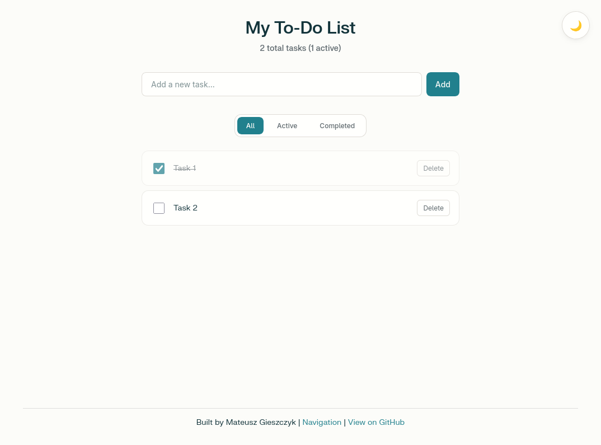

# A Simple To-Do List App

## Description

A simple web app to manage your daily tasks. Add, complete, filter, delete tasks easily.

## Light and dark mode support

## Technologies

- HTML
- CSS
- JavaScript
- Jest

## Deployment Guide

### Workflow Overview

This project uses GitHub Actions for continuous integration and deployment:
- On every push or pull request, tests are run.
- If tests pass, the site is deployed to GitHub Pages and self-hosted server.
- A health check validates the deployment.
- If the health check fails, the workflow automatically rolls back to the previous successful commit.

### How to Deploy

- Push changes to main. The workflow will automatically test, deploy, run a health check, and handle rollback if needed.
- To manually redeploy or roll back, use the Actions tab to re-run a workflow for a specific commit.

### Environment Configuration

- Node.js Version: The workflow uses Node.js 22. Adjust the node-version in .github/workflows/deploy.yml if needed.
- GitHub Pages: For public repositories, no extra configuration is needed. For private repositories, enable GitHub Pages and set the correct permissions.
- Self-Hosted Server:
  - Ensure a self-hosted runner is registered and available in your repository or organization.
  - The self-hosted deployment step copies files to /var/www/html/ on the server. Adjust this path if your server uses a different web root.
  - The runner must have necessary permissions to write to the target directory.
- Secrets: Add any required secrets (such as API keys) in the repository’s Settings > Secrets and reference them in the workflow file as needed.
- Health Check URL: The health check uses the deployed site’s URL. Update this in the workflow if your deployment URL changes.

## Project Structure

- `index.html` — main HTML file 
- `css/style.css` — styles
- `js/app.js` — JavaScript logic
- `navigation.html` — site navigation
- `about.html` — about page of the website
- `package.json` — Defines project dependencies and scripts
- `tests/` — Contains automated test files

## Features

- Add new tasks
- Mark tasks as completed
- Filter tasks by all, active, and completed
- Delete tasks
- Switch the theme

## Author

Mateusz Gieszczyk
